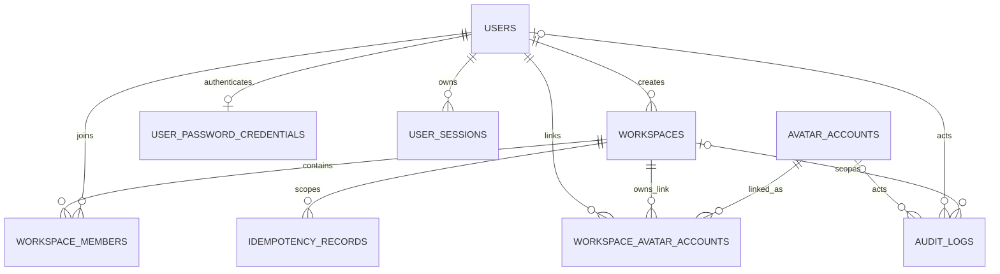

# NovaVend Core Tenancy Database Schema

## Entity relationships



## Tenant boundary

`users` and `avatar_accounts` are global identities. `workspaces` are tenant roots. `workspace_members`, `workspace_avatar_accounts`, workspace audit queries, and `idempotency_records` are tenant-owned. Every repository read for those entities requires an explicit `workspaceId`.

Avatar identity is global because one Second Life avatar UUID represents one durable identity, regardless of merchant workspace. The link is tenant-owned so the same avatar can participate in multiple workspaces with independently revocable relationships.

## Constraints and invariants

- All primary identifiers are UUIDs; membership and avatar links use composite UUID keys.
- `users.email_normalized` and `workspaces.slug` are globally unique.
- `(workspace_id, user_id)` uniquely identifies membership.
- `(workspace_id, avatar_account_id)` uniquely identifies an avatar link.
- `(workspace_id, scope, key_hash)` uniquely identifies an idempotency record.
- The final active workspace owner cannot be demoted or suspended. Mutations are serialized by a transaction-scoped advisory lock.
- Revoked avatar links are reactivated in place.

## Soft deletion

Users and workspaces have nullable `deleted_at` timestamps. Repository soft-delete methods update both the timestamp and status. Normal user/workspace lookups require an active status and a null `deleted_at`. No repository exposes physical deletion for these tables.

## Audit logs

The audit repository exposes append and workspace-scoped read methods only. It has no update or delete API. `metadata` defaults to an empty JSON object. Metadata must never contain raw passwords, session tokens, pairing codes, device secrets, credentials, or idempotency keys. Correlation IDs are preserved when callers provide them.

## Idempotency

Only SHA-256 key and request fingerprints are persisted. A claim returns one of three expected outcomes: first claim, duplicate matching request, or conflicting reuse. Completion and failure are workspace-scoped. Expired rows are removed only through an explicit maintenance method; no scheduler is introduced in TASK-002.

## Migrations

Generate, validate, and apply migrations with:

```bash
pnpm db:generate
pnpm db:check
pnpm db:migrate
```

The committed initial migration is `packages/database/drizzle/0000_core_tenancy.sql` with its Drizzle snapshot and journal metadata.

TASK-004 adds `0001_bizarre_scalphunter.sql` after the tenancy migration. It creates:

- `user_password_credentials`, keyed one-to-one by `user_id`, containing only the Argon2id hash and
  credential timestamps.
- `user_sessions`, containing a UUID identifier, user foreign key, unique SHA-256 `token_hash`,
  creation/last-seen/expiry timestamps, and nullable revocation timestamp.

Session indexes support unique token lookup, active token/expiry/revocation lookup, per-user lookup,
and explicit expiry cleanup. Raw passwords and opaque session tokens never enter PostgreSQL.

## Local reset

The development reset is intentionally destructive and must only target local Docker volumes:

```bash
docker compose down -v
docker compose up -d postgres redis
pnpm db:migrate
pnpm test:integration
```

Never run this reset procedure against a shared or production database.
